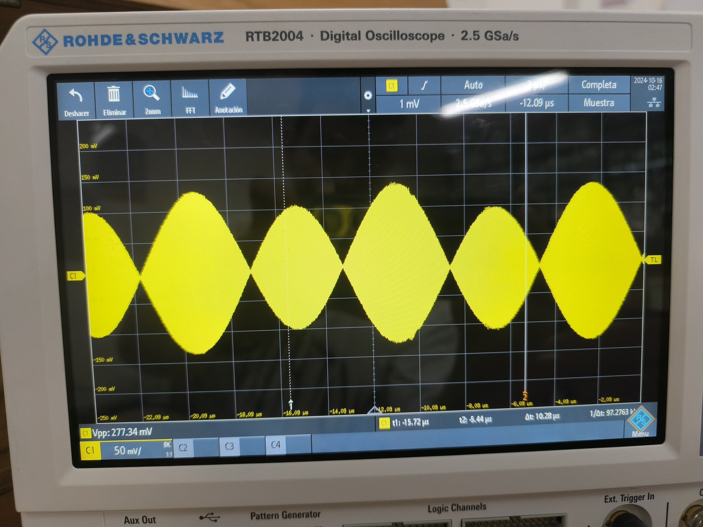
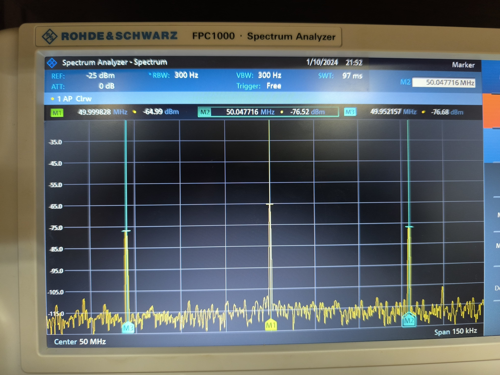

# PRACTICA 3
Con  esta practica se busca comprender a mayor profundidad como funciona una modulacion lineal analizando sus bandas en el analizador de espectros 

modulando la señal, calculanddo su potencia su potencia , como tambien el indice de modulacion,, esto se realizo en el analizador de espectros como en el osciloscopio

