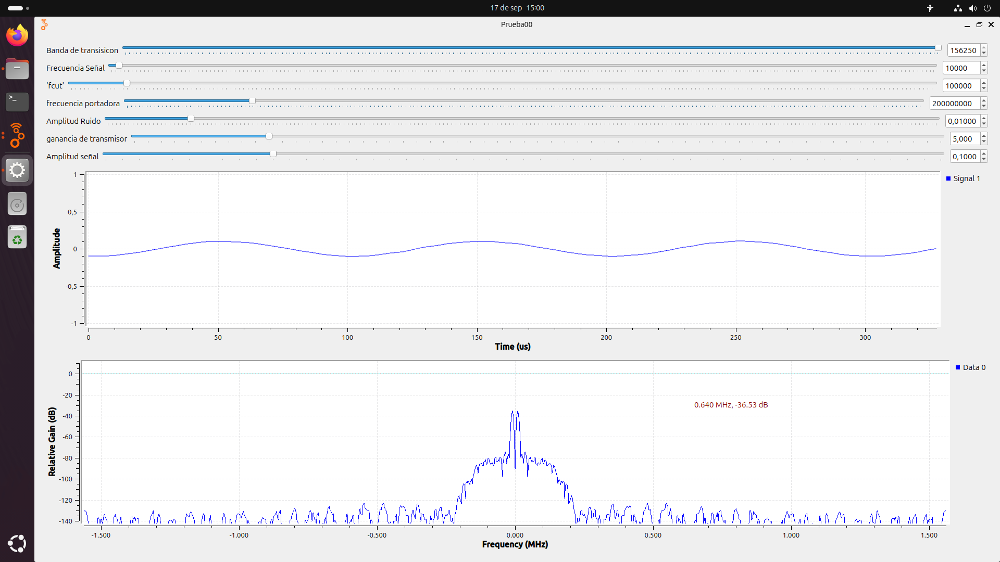

# PRACTICA 2
En la segunda practica empezamos con el tema de verdad haciendo un analisis sobre el canal de transmicion calculando perdidas en el canal, potencias y demas medidas de interes en 
esta practica, en la parte A se hizo con el generador de señales de gnu radio alterando sus parametros en el software para poder visualizar como sde comportan ante el cambio 
señales como esta:

Aqui se debe destacar la importancia del mantttenimiento de los equipos ya que durante el desarrollo de la misma practica se presenttaron inconvenientes debido al estado defectuoso de algunos radios.
Tambien se analizo una señal .wav buscando comprender hasta que punto esta señal era comprensible porque se le estaba añadiendo ruido
