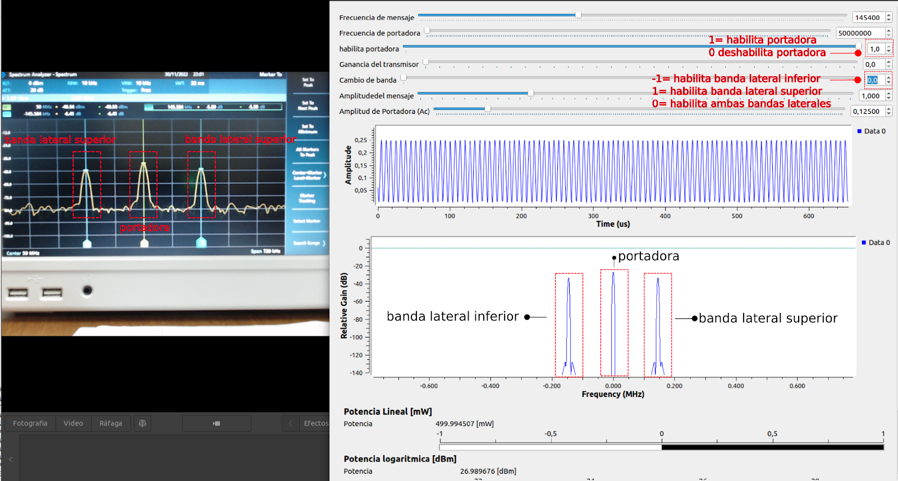
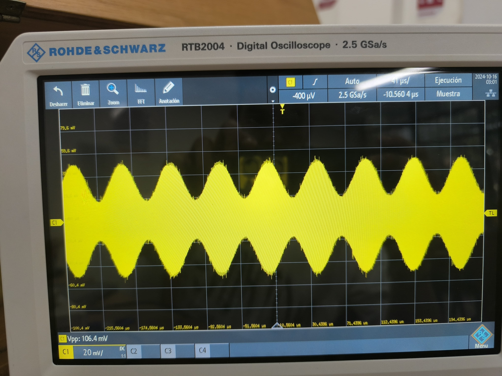
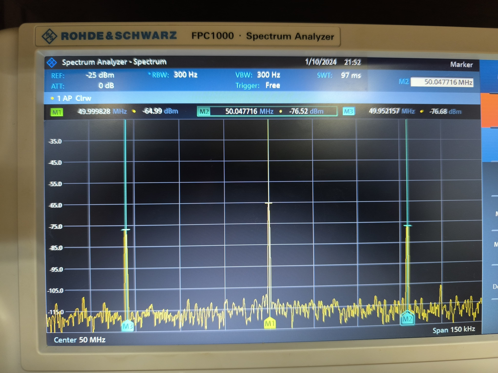

# PRACTICA 3
Con  esta practica se busca comprender a mayor profundidad como funciona una modulacion lineal analizando sus bandas en el analizador de espectros 
esta practica fue una de las mas desafiantes a realizar debido a la inexperiencia de nosotros 

modulando la señal, calculanddo su potencia su potencia , como tambien el indice de modulacion,, esto se realizo en el analizador de espectros como en el osciloscopio

en la parte B de la practtica se debioeron medir en el osciloscopio para los siguientes casos, el tiempo de bit y verificar el indice de modulacion absoluto, usssando un amodificacion del codigo usado en la prte A, esta practica resulta muy intteresanttte para quienes esttatn apasionaddos por las comunicaciones mostrando la complejidad qeu pueden tener los ssistemas modernos de radio.

