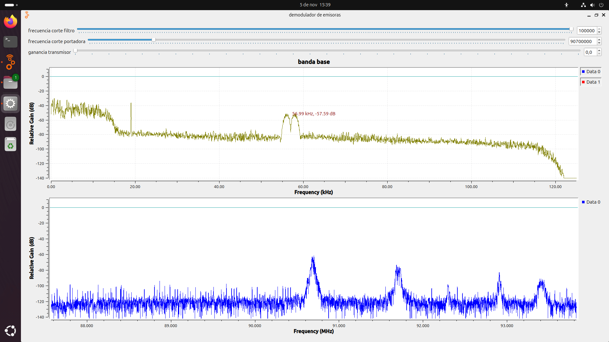
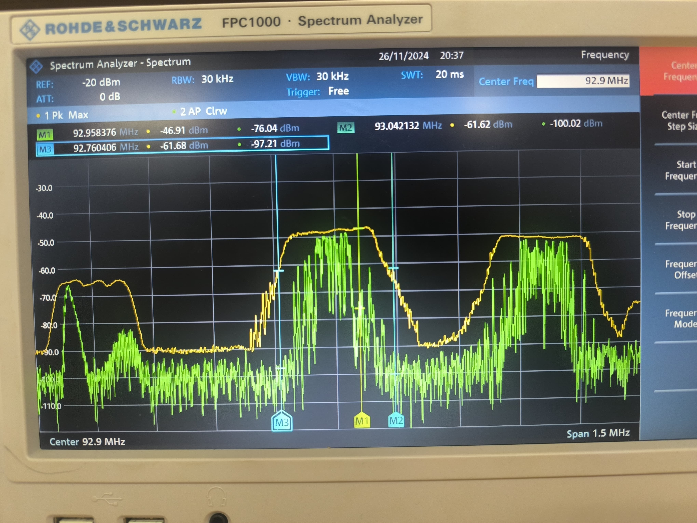

# PRACTICA 4
en esta practica se capto la señal de la emisoras de radio locales se classificaron seguun su tipo y se logro determinar cuales de estas emisoras esstan regsitradas ante la ley y 
y cuales no, sorpresivamenta la señal UIS estereo FM no se encuentra registrada. se uso una antena puesta en el exterior del laboartorio que nos otorgo un gran alcance, las señales
capttadas se visualizaron en el analizador de espectros como en software destinao a este laboratorio (GNU Radio), a continuacion vemos como se visializaba la emisora W Radio en el software. 

y asi se visualiza en el analizador de espectros:

